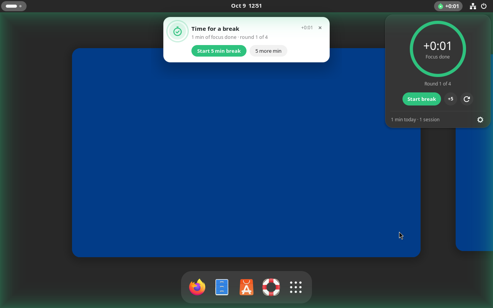
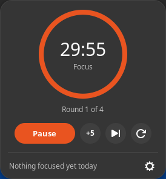

<p align="center">
  
</p>

<h1 align="center">Fermata</h1>

<p align="center">A calm pomodoro timer for the GNOME top bar, with breaks you can't miss.</p>

<p align="center">
  
</p>

Most timers end with a notification that slides away and leaves a red dot you notice an hour later. Fermata's alert stays on screen until you respond. It never covers your work or takes the keyboard.

A *fermata* (𝄐) is the musical sign for a held pause.

## What it does

**It lives in the top bar.** A small stopwatch ring empties as time runs down, next to the countdown.

<p align="center">
  
</p>

- **Click it** for a small card with everything you need. It shows the time left, the round, start/pause, +5 minutes, skip and reset, today's total, and a way into the settings.
- **Right-click it**, or tap with two fingers on a touchpad, to start or pause without opening anything.

<p align="center">
  
</p>

**When time is up, it makes sure you notice:**

- A card slides in at the top of the screen and stays until you start the break, ask for five more minutes, or dismiss it.
- The screen edges glow softly three times, in the colour of what comes next.
- A short chime plays. It rises before focus and falls before a break.
- If you don't respond, it reminds you again every two minutes. The top bar shows how long ago the time ran out.

The alert never takes keyboard focus, and it isn't a system notification, so Do Not Disturb doesn't hide it. If you lock your screen mid-session, the timer keeps going and greets you when you come back.

**Sensible defaults, easy to change.** It runs 30 minutes of focus and 5 minutes of break, with a 15 minute break after every fourth round.

<p align="center">
  
</p>

**Light.** Fermata runs inside GNOME Shell, so there is no extra app in the background. While the timer is paused or idle it does nothing at all. While it runs, it wakes once a second, exactly when the countdown changes.

## Requirements

- **GNOME 45 or newer:** Ubuntu 23.10+, Fedora 39+, Debian 13, and so on. Wayland and X11 both work.
- So far it has been tested on GNOME 46 (Ubuntu 24.04).

For older systems or other desktops (Ubuntu 22.04, KDE, Xfce), use [version 0.1](https://github.com/dhesenkamp/fermata/tree/v0.1.0), a standalone app that sits in the system tray.

## Install

```bash
git clone https://github.com/dhesenkamp/fermata.git
cd fermata
./install.sh
```

GNOME Shell only notices a new extension when it starts. After the first install, log out and back in, or on X11 press <kbd>Alt</kbd>+<kbd>F2</kbd>, type `r` and press <kbd>Enter</kbd>. Updates install the same way.

To remove it again, run `./install.sh --uninstall`.

## From the command line

The installer also adds a small `fermata` command, handy for scripts and keyboard shortcuts:

| Command | What it does |
| --- | --- |
| `fermata toggle` | Start, pause or resume |
| `fermata skip` | Jump to the next phase |
| `fermata extend` | Add five minutes |
| `fermata reset` | Back to round one |
| `fermata status` | Print the current state, e.g. `Focus · 12:40 left` |
| `fermata open` | Open the card |
| `fermata preview` | Show the alert without touching the timer |
| `fermata preferences` | Open the settings |

To start and pause from the keyboard, go to *Settings → Keyboard → View and Customise Shortcuts → Custom Shortcuts* and add a shortcut with the command `fermata toggle`.

If your terminal says `command not found: fermata`, then `~/.local/bin` isn't on your `PATH` yet. Add it in your shell's config file and open a new terminal:

```bash
echo 'export PATH="$HOME/.local/bin:$PATH"' >> ~/.zshrc   # or ~/.bashrc
```

## Development

| Path | Contents |
| --- | --- |
| `extension/` | The extension as it is packed. `lib/timer.js` is the timer logic, `lib/indicator.js` the top bar and card, `lib/alert.js` the alert and glow. |
| `tests/` | Tests for the timer logic: `gjs -m tests/timer.test.js` |
| `tools/make-chimes.py` | Synthesises the two chimes in `extension/sounds/` |
| `./install.sh --pack` | Builds the zip for extensions.gnome.org |

## License

Fermata is free software under the [GNU General Public License v3.0 or later](LICENSE).
