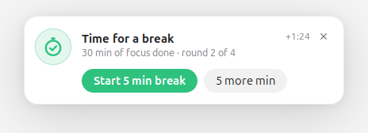
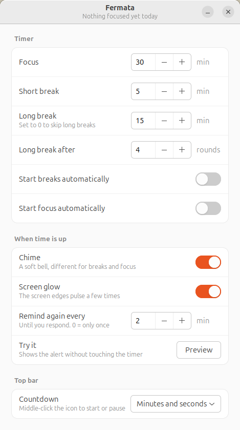

<p align="center">
  
</p>

<h1 align="center">Fermata</h1>

<p align="center">A calm pomodoro timer for the GNOME top bar, with breaks you can't miss.</p>

<p align="center">
  <picture>
    <source media="(prefers-color-scheme: dark)" srcset="screenshots/card-short-dark.png">
    
  </picture>
</p>

Most timers end with a notification that slides away and leaves a red dot you notice an hour later. Fermata's alert stays on screen until you respond. It never covers your work or takes the keyboard.

A *fermata* (𝄐) is the musical sign for a held pause.

## What it does

**It lives in the top bar.** A small stopwatch ring empties as time runs down, next to the countdown. Click it for the menu, or middle-click to start or pause.

<p align="center">
  
</p>

**When time is up, it makes sure you notice:**

- A card slides in at the top of the screen and stays until you start the break, ask for five more minutes, or dismiss it.
- The screen edges glow softly three times, in the colour of what comes next.
- A short chime plays. It rises before focus and falls before a break.
- If you don't respond, it reminds you again every two minutes. The top bar shows how long ago the time ran out (`+0:45`).

The alert never takes keyboard focus or blocks clicks outside the card. It is not a system notification, so Do Not Disturb doesn't hide it.

**Sensible defaults, easy to change.** It runs 30 minutes of focus and 5 minutes of break, with a 15 minute break after every fourth round. The menu has 25/5, 30/5, 45/10 and 50/10 presets, and everything else is in Preferences.

<p align="center">
  
</p>

**One file, nothing to install.** Fermata is a single Python script that uses only what Ubuntu already ships: Python 3, GTK 3 and the AppIndicator extension.

## Requirements

- **Ubuntu 22.04 or newer** with the standard Ubuntu desktop, on Wayland or X11. The top bar icon comes from Ubuntu's built-in *Ubuntu AppIndicators* extension. If it is switched off, Fermata offers to turn it back on.
- **Other GNOME distributions** such as Fedora or Debian need the [AppIndicator and KStatusNotifierItem Support](https://extensions.gnome.org/extension/615/appindicator-support/) extension.
- **Other desktops** with a system tray, such as KDE Plasma or Xfce, may work but are untested. The tray icon is designed for a dark panel.

So far Fermata has been tested on Ubuntu 24.04 (GNOME 46 on X11, two monitors). Reports from other setups are very welcome. On Wayland, Fermata's windows run through XWayland, because that is the only way the alert can float above other windows without taking focus.

## Install

```bash
git clone https://github.com/dhesenkamp/fermata.git
cd fermata
./install.sh
```

The script installs Fermata for your user only, with no `sudo`. It copies the app to `~/.local/bin/fermata`, adds it to the app grid, starts it at login and starts it now.

- To skip starting at login, use `./install.sh --no-autostart`.
- To try it without installing, run `./fermata.py`.
- To remove it again, run `./install.sh --uninstall`. Your settings are kept.

## Use

Everything is in the top bar menu. The same actions are available from the command line, for scripts and keyboard shortcuts:

| Command | What it does |
| --- | --- |
| `fermata --toggle` | Start, pause or resume |
| `fermata --skip` | Jump to the next phase |
| `fermata --extend` | Add five minutes |
| `fermata --reset` | Back to round one |
| `fermata --status` | Print the current state, e.g. `Focus · 12:40 left` |
| `fermata --preview` | Show the alert without touching the timer |
| `fermata --preferences` | Open preferences |
| `fermata --quit` | Quit |

To start and pause from the keyboard, go to *Settings → Keyboard → View and Customise Shortcuts → Custom Shortcuts* and add a shortcut with the command `fermata --toggle`.

## Files

| What | Where |
| --- | --- |
| Settings | `~/.config/fermata/config.json` |
| Today's sessions | `~/.local/state/fermata/stats.json` |
| Generated icons and chimes | `~/.cache/fermata/` |

## How it works

- **Tray icon:** Fermata implements the StatusNotifierItem and DBusMenu protocols directly over D-Bus with Gio, so it doesn't need libappindicator. The menu is GNOME Shell's own.
- **Alert:** the card and the edge glow are override-redirect X11 windows, which stay above everything and never take focus. They are made click-through with XFixes input shapes, called through `ctypes`. This avoids a dependency on `python3-gi-cairo`, which Ubuntu doesn't install by default.
- **Sound:** the chimes are synthesised once on first run and played with `pw-play`, falling back to `paplay` or `aplay`.

## License

Fermata is free software under the [GNU General Public License v3.0 or later](LICENSE).
